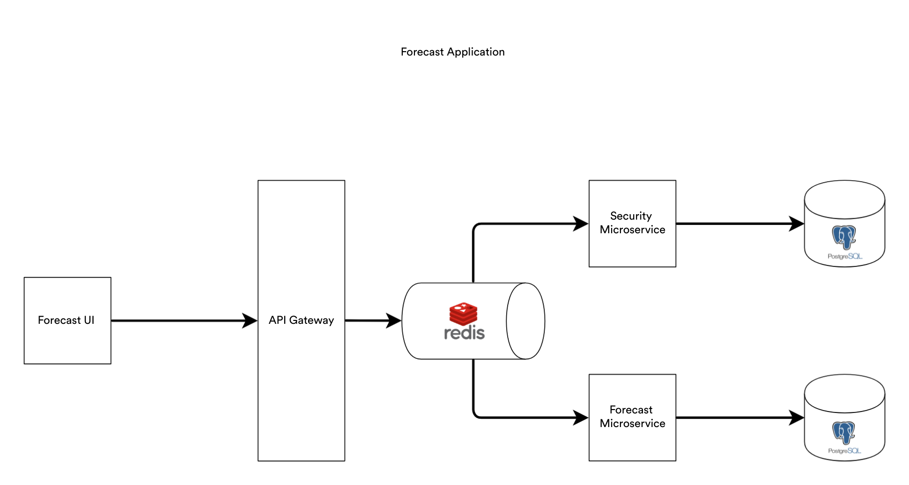
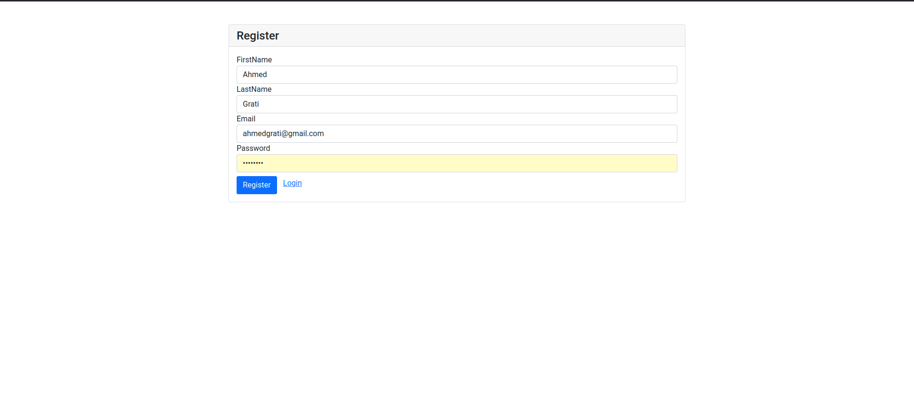
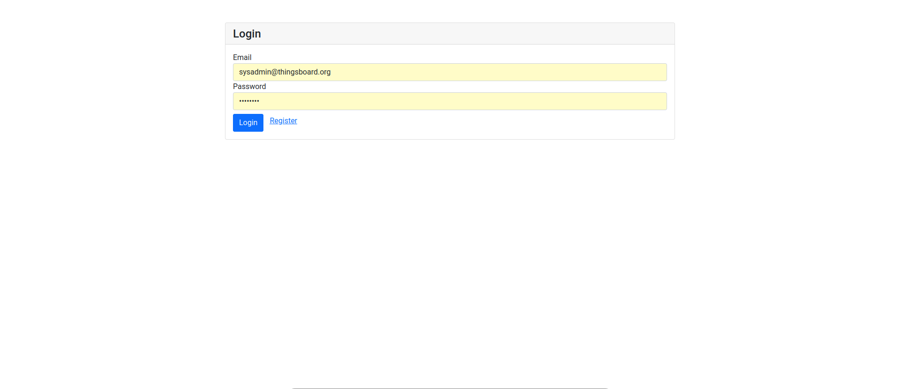
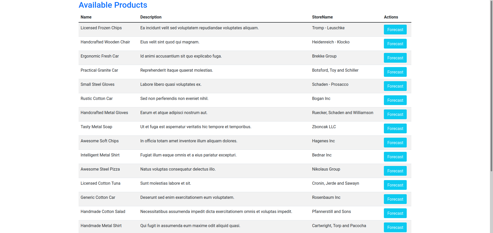
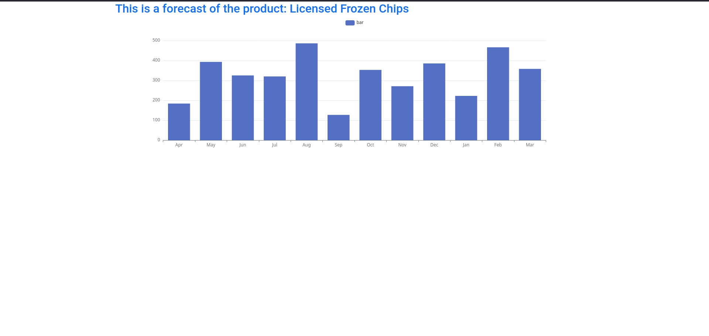

# Microservices-archi-lab
This is a microservices lab of software architecture.
# Team
Ahmed Grati, Zied Kanoun, Omar Jeridi
# Architecture
<br><br>
The application is composed:
- **Forecast UI:** It is the application that displays all the interfaces for the user to interact with the whole system.
- **API Gateway:** It is the component, that orchestrate requests and hide the underlying backend from the client. All requests should pass through it.
- **Redis Queue:** All communications between the API Gateway and the other components are event-based, and those events are stored in the Redis queue, that will be consumed by the concerned component.
- **Security Microservice:** It implements the authentication and authorization mechanisms.
- **Forecast Microservice:** Its role is to predict of the sales of a specific product (Note that the actual returned data is a mock data not a real one).
# Installation
To run the project simply run:
```bash
docker-compose up
```
# Execution
<br><br>
<br><br>
<br><br>
<br><br>